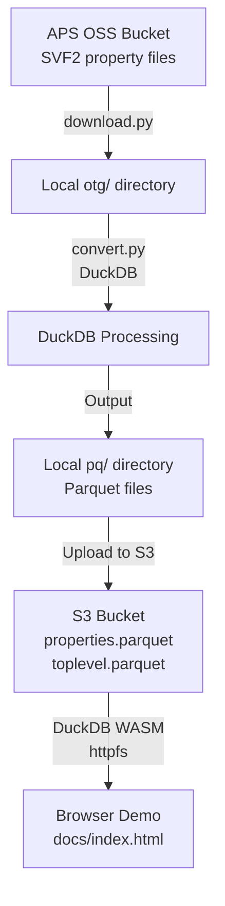

# SVF2 Properties to Parquet with DuckDB

This project provides a workflow to efficiently convert Autodesk SVF2 property data into a single columnar Parquet file using DuckDB, and query it directly in the browser using DuckDB WASM and httpfs.

## Live Demo

🚀 **[View the live demo](docs/index.html)** - A browser-based parquet data explorer powered by DuckDB WASM

Screenshot: <INSERT>


## Workflow Overview



## Directory Structure

```
vibe-duckdb-svf2-properties/
  ├── convert.py              # Convert OTG to Parquet
  ├── download.py             # Download SVF2 files from APS
  ├── query.py                # Local query examples
  ├── docs/
  │   └── index.html          # DuckDB WASM demo page
  ├── otg/                    # Raw SVF2 property files
  │   ├── attrs.json
  │   ├── avs.idx
  │   ├── avs.pack
  │   ├── dbid.idx
  │   ├── ids.json
  │   ├── otg_model.json
  │   └── vals.json
  ├── pq/                     # Generated Parquet files
  │   ├── attrs.parquet
  │   ├── av_pairs.parquet
  │   ├── ice.duckdb
  │   ├── ids.parquet
  │   ├── properties.parquet  # Main properties table
  │   ├── toplevel.parquet    # Top-level object hierarchy
  │   └── vals.parquet
  ├── README.md
  └── svf2-props.http         # REST Client test requests
```

## How to Use

### 1. Download SVF2 Property Files

Download SVF2 property files from Autodesk APS/Forge using the URN:

```sh
python3 download.py <YOUR_URN>
```

**Getting a URN**: Visit [viewer.aps-autodesk.com](https://viewer.aps-autodesk.com) and inspect the model URL or dev tools to find the URN.

This populates the `otg/` directory with the required files.

### 2. Convert to Parquet

Process the raw files and generate optimized Parquet outputs:

```sh
python3 convert.py
```

This creates the `pq/` directory with:
- `properties.parquet` - Main properties data
- `toplevel.parquet` - Object hierarchy 
- Additional supporting files

### 3. Upload to S3 (Optional)

For the browser demo, upload these files to a public S3 bucket with CORS enabled:

- `properties.parquet`
- `toplevel.parquet`

### 4. Browser Demo

Open `docs/index.html` in your browser for a live demo featuring:

- ✅ **Zero-server architecture** - Everything runs in your browser
- ✅ **Real-time streaming** - Direct S3 access without downloading full files
- ✅ **Interactive search** - Filter by dbid with instant results
- ✅ **Responsive tables** - Modern UI with collapsible hierarchies
- ✅ **DuckDB WASM** - Full SQL analytics in the browser

To use with your own data, update the S3 URLs in `docs/index.html`:

```javascript
const PROPERTIES_URL = "https://your-bucket.s3.region.amazonaws.com/properties.parquet";
const TOPLEVEL_URL = "https://your-bucket.s3.region.amazonaws.com/toplevel.parquet";
```

## Features

- **📊 Columnar Analytics**: Super-efficient storage and querying with Parquet + DuckDB
- **🌐 Browser-Native**: No backend servers - runs entirely in the browser via WASM  
- **⚡ Real-time Streaming**: Direct S3 access without downloading full files
- **🎨 Modern UI**: Clean, responsive interface with [pico.css](https://picocss.com/)
- **🔍 Interactive Exploration**: Search, filter, and browse object hierarchies
- **📱 Cross-Platform**: Works on any modern browser (Chrome, Firefox, Safari)

## Technical Architecture

- **Data Pipeline**: Python → DuckDB → Parquet
- **Frontend**: DuckDB WASM 1.29.0 + httpfs extension
- **Storage**: S3-compatible object storage
- **UI Framework**: Semantic HTML + pico.css
- **Query Engine**: DuckDB running in WebAssembly

## Local Development

```sh
# Start local server for testing
python3 -m http.server 8000 --directory docs

# Open browser
open http://localhost:8000
```

## API Testing with REST Client

The `svf2-props.http` file contains HTTP requests for testing Autodesk APS API endpoints. This is a powerful alternative to Postman that integrates directly into VS Code/Cursor.

**Setup:**
1. Install the [REST Client extension](https://marketplace.visualstudio.com/items?itemName=humao.rest-client) in VS Code/Cursor
2. Open `svf2-props.http` 
3. Use Cursor AI to generate and test API requests
4. Click "Send Request" above any HTTP request block

**Benefits over Postman:**
- ✅ **Free and lightweight** - No account required
- ✅ **Version control friendly** - Plain text files you can commit
- ✅ **Cursor AI integration** - Generate requests with AI assistance
- ✅ **Inline results** - See responses directly in the editor
- ✅ **Variable support** - Use `{{variable}}` syntax for tokens, URNs, etc.
- ✅ **Request chaining** - Extract values from responses to use in subsequent requests
- ✅ **Shared context** - Variables and auth tokens persist across requests

Example usage:
```http
### 1. Get access token
POST https://developer.api.autodesk.com/authentication/v1/authenticate
Content-Type: application/x-www-form-urlencoded

client_id={{client_id}}&client_secret={{client_secret}}&grant_type=client_credentials&scope=data:read

### 2. Use token from previous request
GET https://developer.api.autodesk.com/modelderivative/v2/designdata/{{urn}}/metadata
Authorization: Bearer {{access_token}}
```

Perfect for debugging APS endpoints during development!

---

**Powered by [DuckDB](https://duckdb.org/), [WebAssembly](https://webassembly.org/), and the [httpfs extension](https://duckdb.org/docs/extensions/httpfs).** 